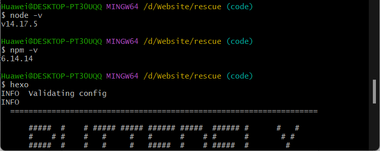

# 网站说明


## 0. 写在前面

很早之前就发现了这个网站，很久没有更新了，但一直没有时间去更新这个网站。2022年4月对老一版网站做了几次更新，出现了版本不适配的问题，后来老学长授权我重建网站。2022.7.26调试机器人调试麻了，尝试重启网站。

> 第一版网站保存在：[branch: dev](https://github.com/team-explorer-rescue-robot/team-explorer-rescue-robot.github.io/tree/dev)，搭建人为：陈德祥、廖竟吕、孙家岱。

在 Github 上搜索 key: website，排名最高的是[kubernetes/*website*](https://github.com/kubernetes/website)，页面挺好看的，我尝试了一下，[Hugo (Extended version)](https://gohugo.io/) 有一些地方出了问题，配置过程很慢，让我失去了耐心。所以从自己较为熟悉的 [Hexo](https://github.com/hexojs/hexo) 框架着手重构网站。

框架 Hexo，主题 ButterFly.

## 1. Hexo

Hexo 的 设置和发布都很简单，步骤比较明确。

可见 [hexo's readme](https://github.com/hexojs/hexo) 以及 [官方文档](https://hexo.io/docs/)。

## 2. ButterFly

主题使用的是 [ButterFly](https://github.com/jerryc127/hexo-theme-butterfly).

具体参考 [readme](https://github.com/jerryc127/hexo-theme-butterfly) 以及 [说明文档](https://butterfly.js.org/posts/21cfbf15/)，我是按照后者进行相关配置的。

## 3. 一些问题记录

### 3.1 更改主题后页面一行报错

Hexo更改主题后启动服务器，界面显如下字符:

```
extends includes/layout.pug block content include includes/recent-posts.pug include includes/partial
```

解决方案:

执行如下命令

```
npm install --save hexo-renderer-jade hexo-generator-feed hexo-generator-sitemap hexo-browsersync hexo-generator-archive
```

清除缓存

```
hexo clean
```

生成静态文件即可

```
hexo g
```


### 3.2 修改之后重启服务器出现中文乱码

框架默认编码utf-8，我新建了一个_config.yml文件，编码格式不对，修改之后就正确了。修改主题建议先复制一份yml，再重命名，修改内容即可，编码格式就不会错。

> 官网建议主题的配置文件放入博客一级目录下，我照做了。
>
> 即将 /blog/themes/butterfly 下的 _config.yml 内容复制到 /blog 下，命名为  _config.butterfly.yml。
>
> 框架会将 这个 yml与博客设置文件 _config.yml 合并，并且 这个 yml 的优先级更高。


### 3.3 强制覆盖远程仓库

由于是重建博客，需要以本地仓库为基准，覆盖远程仓库，首先将远程仓库转入 dev分支。

```shell
# 将当前master分支（原博客）存入新的分支 dev1 作为备份
git push origin master:dev
# 切换到新的博客仓库
git init 
git commit -m 'update'
# 与远端仓库关联
git remote add origin git@github.com:team-explorer-rescue-robot/team-explorer-rescue-robot.github.io.git
# 强制覆盖
git push -f origin master
```

推送至 github 上线网站的设置：参考了

1. https://jiangshibiao.github.io/Hexo-Butterfly/
2. [hexo 官方文档](https://hexo.io/docs/)


### 3.4 ERROR Deployer not found: git

这是因为没安装`hexo-deployer-git`插件，在**站点目录**下输入下面的插件安装就好了：

```shell
npm install hexo-deployer-git --save
```

然后在使用`Hexo d`命令就可以推送了。

### 3.5 网站源码问题

推送更新网站使用 hexo d 很方便，但是源码就没有完全放在Github上。所以，我新建了一个分支code，这个分支就是本地所有源码，`hexo n page newpage`就可以生成新页面。

### 3.6 重装系统 nodejs 和 hexo 的重新配置

2022年9月12日杜某人的win10崩掉了，重装系统后很多编程环境都丢失了。下面记录如题所示的问题：

1. 找到nodejs所在目录，如 `D:\Software\Node.js`，将这个路径添加到系统变量Path中。

2. 找到源码目录下的node_modules//.bin，如`D:\Website\rescue\node_modules\.bin`，添加到系统变量Path中。

3. 查看nodejs和hexo的复原情况：

   